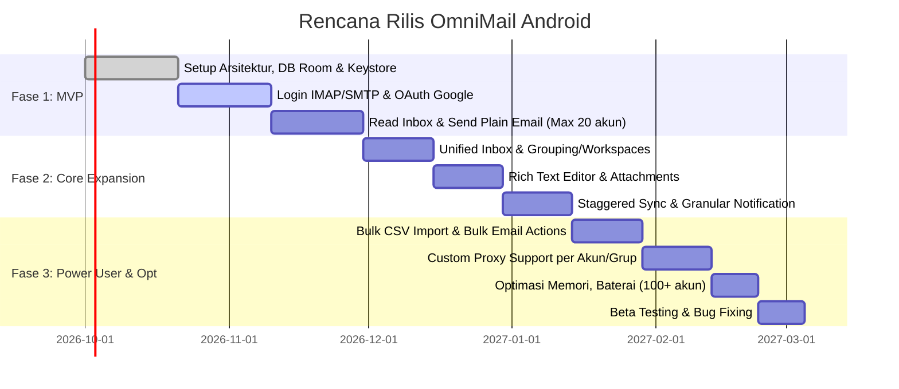

# PRODUCT REQUIREMENTS DOCUMENT (PRD)

| Parameter | Detail |
| :--- | :--- |
| **Nama Produk** | OmniMail Android (Nama Sementara) |
| **Versi Dokumen** | 1.0 |
| **Target Platform** | Android (Minimum SDK 24 / Android 7.0 Nougat) |
| **Fokus Utama** | Manajemen, penerimaan, dan pengiriman email untuk jumlah akun tak terbatas (*Mass Multi-Account Management*). |

---

## 1. PENDAHULUAN

### 1.1 Latar Belakang & Masalah
Sebagian besar klien email Android yang ada (seperti Gmail atau Outlook) dioptimalkan untuk penggunaan pribadi (1–5 akun). Ketika pengguna (seperti *digital marketer*, agensi, atau *customer support*) mencoba memasukkan puluhan hingga ratusan akun, aplikasi tersebut menjadi sangat lambat, sering *crash*, atau bahkan membatasi jumlah maksimal akun yang dapat didaftarkan.

### 1.2 Tujuan Produk
Membuat aplikasi klien email berbasis Android yang sangat dioptimalkan untuk menampung puluhan hingga ratusan akun email tanpa mengorbankan performa perangkat, serta menyediakan fitur pengelolaan massal (*bulk management*) yang stabil dan andal.

### 1.3 Target Pengguna
- **Digital Marketers / Agensi**: Pengelola *email campaigns*, *cold email outreach*, dan monitoring akun klien.
- **Tim Customer Service**: Penanganan banyak kanal kotak masuk (*support tickets*, multi-brand support).
- **Power Users / Entrepreneurs**: Individu yang mengelola banyak portofolio bisnis atau banyak domain sekaligus.

---

## 2. SCOPE & LIMITATIONS (Ruang Lingkup & Batasan)

### In-Scope
- Autentikasi & Login via IMAP/SMTP serta OAuth 2.0 (Google, Microsoft).
- Unified Inbox (Kotak Masuk Terpadu) lintas akun.
- Manajemen folder standar (Inbox, Sent, Drafts, Trash, Spam).
- Pengiriman email lengkap dengan lampiran (*attachments*).
- Sinkronisasi latar belakang (*background sync*) yang cerdas dan terkelola.

### Out-of-Scope (Fase 1)
- Sinkronisasi Kalender (Calendar sync).
- Sinkronisasi Kontak (Contact sync).
- Integrasi pihak ketiga (seperti Trello, Notion, CRM, Slack, dll).

---

## 3. FITUR & FUNCTIONAL REQUIREMENTS (Kebutuhan Fungsional)

### Epic 1: Manajemen Akun (Account Management)
Aplikasi harus dapat menangani penambahan, pengeditan, pengelompokan, dan penghapusan banyak akun secara efisien.

#### FR 1.1: Penambahan Akun Otomatis & Manual
- **Deskripsi**: Pengguna dapat menambahkan akun melalui OAuth 2.0 (Gmail, Outlook) atau konfigurasi manual (IMAP/POP3 & SMTP).
- **Acceptance Criteria (AC)**:
  - Sistem mendeteksi otomatis pengaturan host server IMAP/SMTP, port, dan enkripsi (SSL/TLS/STARTTLS) berdasarkan domain email (misal: `@yahoo.com` otomatis mengisi port 993 IMAP dan 465/587 SMTP).
  - Validasi kredensial langsung dilakukan sebelum akun disimpan ke database.

#### FR 1.2: Bulk Account Import (Impor Massal)
- **Deskripsi**: Pengguna dapat mengimpor puluhan akun sekaligus menggunakan file `.csv`.
- **Format CSV**: `email,password/app_password,imap_server,imap_port,smtp_server,smtp_port`
- **Acceptance Criteria (AC)**:
  - Tersedia progress bar visual selama proses verifikasi akun massal.
  - Jika terdapat akun yang gagal diverifikasi, tampilkan ringkasan daftar email gagal beserta alasan errornya (misal: *invalid password*, *connection timeout*).

#### FR 1.3: Pengelompokan Akun (Workspaces/Groups)
- **Deskripsi**: Pengguna dapat mengelompokkan akun ke dalam kategori/grup (Contoh: "Bisnis A" berisi 10 akun, "Support" berisi 5 akun).
- **Acceptance Criteria (AC)**:
  - Pengguna dapat memberikan label warna (*Color Tags*) untuk setiap grup agar mudah dibedakan di UI.
  - Akun dapat dipindahkan antar-grup dengan mudah.

#### FR 1.4: Proxy per Akun / Grup (Fitur Lanjutan)
- **Deskripsi**: Untuk menghindari pembatasan atau pemblokiran IP oleh provider email akibat login banyak akun dari 1 IP yang sama, pengguna dapat mengatur proxy khusus.
- **Acceptance Criteria (AC)**:
  - Mendukung protokol HTTP, HTTPS, dan SOCKS5 proxy.
  - Proxy dapat diset secara individual per akun atau diwarisi dari level grup/workspace.

---

### Epic 2: Pengalaman Kotak Masuk (Inbox Experience)

#### FR 2.1: Unified Inbox (Kotak Masuk Terpadu)
- **Deskripsi**: Menampilkan semua email masuk dari seluruh akun yang aktif di satu linimasa terpadu.
- **Acceptance Criteria (AC)**:
  - Setiap baris email memiliki badge warna/label yang menunjukkan akun tujuan email tersebut.
  - Terdapat dropdown/filter cepat di bagian header untuk memfilter tampilan hanya akun tertentu atau grup tertentu.

#### FR 2.2: Threading & Conversation View
- **Deskripsi**: Mengelompokkan rangkaian email dengan subjek dan *References*/*In-Reply-To* yang sama ke dalam format percakapan berurutan (*threaded view*).

#### FR 2.3: Bulk Actions (Aksi Massal)
- **Deskripsi**: Memungkinkan pengguna memilih banyak email sekaligus (lintas akun) untuk dieksekusi secara serentak.
- **Acceptance Criteria (AC)**:
  - Opsi: *Mark as Read / Unread*, *Delete*, *Archive*, *Move to Folder*, *Mark as Spam*.
  - Aksi dilakukan secara asynchronous tanpa memblokir interaksi pengguna di layar.

#### FR 2.4: Offline Caching & Lazy Loading
- **Deskripsi**: Optimalisasi konsumsi memori dan bandwidth dengan strategi caching bertahap.
- **Acceptance Criteria (AC)**:
  - Saat inisiasi, aplikasi hanya mengunduh 50 email terakhir dari setiap akun (atau email dalam 7 hari terakhir).
  - Email lebih lama dimuat secara *on-demand* saat pengguna melakukan scroll ke bawah (*infinite scroll / pagination*).

---

### Epic 3: Pengiriman Email (Composer)

#### FR 3.1: Multi-Sender Selection
- **Deskripsi**: Pemilihan identitas pengirim secara fleksibel saat membuat email baru.
- **Acceptance Criteria (AC)**:
  - Field "From" (Dari) berupa dropdown searchable yang mencakup semua akun aktif.
  - Secara default menggunakan akun dari inbox yang sedang dibuka atau default sender pilihan user.

#### FR 3.2: Rich Text Editor
- **Deskripsi**: Editor format teks lengkap yang mendukung:
  - Bold, Italic, Underline, Strikethrough
  - Bullet & Numbered List
  - Hyperlink
  - HTML formatting sederhana

#### FR 3.3: Manajemen Lampiran (Attachment)
- **Deskripsi**: Kemampuan melampirkan berkas dari penyimpanan lokal perangkat Android.
- **Acceptance Criteria (AC)**:
  - Menampilkan peringatan visual jika total ukuran lampiran melebihi ambang batas standar (misal: > 25MB).
  - Menyediakan preview thumbnail untuk file gambar dan dokumen umum.

#### FR 3.4: Signature (Tanda Tangan) per Akun
- **Deskripsi**: Pengguna dapat mengonfigurasi tanda tangan (*rich text* atau *plain text*) spesifik untuk setiap akun email secara independen.

---

### Epic 4: Pencarian & Filter (Search)

#### FR 4.1: Global Search
- **Deskripsi**: Fitur pencarian menyeluruh berdasarkan kata kunci (*keyword*), alamat pengirim (*sender*), penerima (*recipient*), atau subjek di seluruh akun yang terdaftar.
- **Acceptance Criteria (AC)**:
  - Memanfaatkan indexing database lokal (FTS / SQLite Index) untuk pencarian instan pada email yang sudah ter-cache.
  - Opsi pencarian lanjutan langsung ke server (IMAP Search) jika data lokal tidak mencukupi.

---

### Epic 5: Sinkronisasi & Notifikasi

#### FR 5.1: Smart Background Sync (Staggered)
- **Deskripsi**: Mekanisme sinkronisasi bergilir agar ratusan akun tidak melakukan *handshake* jaringan di detik yang sama, mencegah *resource spike* dan *freeze*.
- **Acceptance Criteria (AC)**:
  - Pengguna dapat memilih mode & interval sync:
    - **Push (IMAP IDLE)**: Dibatasi maksimal 5–10 akun prioritas utama.
    - **Periodic Sync**: Pilihan interval (15 menit, 30 menit, 1 jam, atau Manual/Pull-to-refresh).
  - Eksekusi sync dilakukan bergiliran (*batching/staggered*) melalui queue background job.

#### FR 5.2: Granular Notifications
- **Deskripsi**: Pengaturan preferensi notifikasi per akun.
- **Acceptance Criteria (AC)**:
  - Mendukung konfigurasi: *Alert Sound & Vibration*, *Silent Notification (Notif Bar only)*, atau *Mute Completely*.
  - Dukungan Notification Channels Android untuk setiap grup akun.

---

## 4. NON-FUNCTIONAL REQUIREMENTS (Kebutuhan Non-Fungsional)

### 4.1 Performa & Penggunaan Sumber Daya (Crucial)
- **Memory Management**:
  - Alokasi RAM aplikasi di latar belakang tidak boleh melebihi **300 MB – 500 MB** meskipun menampung hingga 100+ akun.
  - Pencegahan *memory leak* pada socket connection IMAP.
- **Database Performance**:
  - Menggunakan Room Database (abstraksi SQLite) dengan indexing teroptimasi pada kolom `account_id`, `message_id`, `timestamp`, dan `folder_id`.
  - Waktu respons query Unified Inbox harus di bawah **1 detik**.
- **Battery Drain**:
  - Menggunakan Android `WorkManager` untuk background tasks dengan *Constraints* (misal: `NetworkType.CONNECTED`).
  - Aplikasi tidak boleh memicu notifikasi peringatan sistem Android *"High Battery Usage"*.

### 4.2 Keamanan & Privasi (Security)
- **Data Encryption at Rest**:
  - Seluruh password IMAP/SMTP dan OAuth Refresh Tokens **WAJIB** dienkripsi menggunakan standar **AES-256 GCM**.
  - Master key enkripsi dikelola dan disimpan secara aman di **Android Keystore System**.
- **No Middleware Server (Zero-Knowledge Architecture)**:
  - Aplikasi terhubung langsung dari perangkat klien ke server IMAP/SMTP penyedia email (*client-to-server direct*).
  - Tidak ada server perantara (*middle-server*) milik pengembang yang membaca, menyimpan, atau merutekan kredensial maupun konten email pengguna.
- **App Lock**:
  - Proteksi akses aplikasi menggunakan otentikasi biometrik (Fingerprint, Face Unlock) atau PIN/Password via Android BiometricPrompt API.

---

## 5. USER INTERFACE (UI) & USER EXPERIENCE (UX)

- **Tema & Desain**:
  - Mengadopsi prinsip **Material Design 3 (Material You)** dengan dynamic color theming.
  - Dukungan penuh untuk **Dark Mode** dan **Light Mode**.
- **Navigasi Utama**:
  - **Bottom Navigation**: Kotak Masuk (Inbox), Pencarian (Search), Pengaturan (Settings).
  - **Side Drawer (Navigation Drawer)**:
    - Daftar Folder Sistem (Inbox, Sent, Drafts, Trash, Spam).
    - Daftar Akun & Grup Akun untuk switching tampilan instan.
- **Floating Action Button (FAB)**:
  - Terletak di sudut kanan bawah untuk aksi cepat menulis email baru (*Compose*).
- **Gestures (Swipe Actions)**:
  - Swipe Kanan: Tandai Sudah Dibaca / Belum Dibaca (*Mark Read/Unread*).
  - Swipe Kiri: Hapus / Arsipkan (*Delete / Archive*). Dapat dikustomisasi di menu pengaturan.

---

## 6. TEKNOLOGI & ARSITEKTUR YANG DISARANKAN

| Komponen | Pilihan Teknologi / Library | Catatan |
| :--- | :--- | :--- |
| **Bahasa Pemrograman** | Kotlin | Integrasi native Android, null safety, dan ekosistem modern. |
| **Arsitektur** | MVVM + Clean Architecture | Memisahkan UI, Domain Logic, dan Data Layer agar modular dan *testable*. |
| **Email Protocols** | Jakarta Mail (JavaMail API) | Menangani koneksi IMAP, POP3, SMTP, dan parsing MIME message. |
| **OAuth & Networking** | Retrofit, OkHttp, AppAuth-Android | Pertukaran token OAuth 2.0 (Google, Microsoft) dan manajemen koneksi proxy. |
| **Database Lokal** | Room Database + Paging 3 | Manajemen cache lokal dengan paging list untuk scrolling ribuan pesan tanpa lag. |
| **Dependency Injection** | Hilt (Dagger) | Standar industri untuk Android DI. |
| **Asynchronous & Concurrency** | Kotlin Coroutines & Flow | Penanganan background processing, reactive stream, dan lifecycle-aware operations. |
| **Background Processing** | Android WorkManager | Penjadwalan sync periodik yang ramah baterai dan taat Doze Mode. |
| **Keamanan** | Android Keystore & EncryptedSharedPreferences | Penyimpanan kunci kriptografis dan token terenkripsi. |

---

## 7. RENCANA RILIS (Milestones)

### Ringkasan Timeline
1. **Fase 1: MVP (Minimum Viable Product) – Durasi: 2 Bulan**
   - Setup arsitektur dasar, Room database, dan modul enkripsi Keystore.
   - Login manual IMAP/SMTP dan OAuth Google.
   - Membaca inbox, detail email, dan pengiriman email standar (tanpa attachment).
   - Mendukung kapasitas awal hingga 20 akun.
2. **Fase 2: Core Features Expansion – Durasi: 1.5 Bulan**
   - Unified Inbox terpadu dan fitur pengelompokan akun (Workspaces).
   - Rich Text Editor dan penanganan file attachment.
   - Smart Staggered Background Sync dan granular notification system.
3. **Fase 3: Power User & Optimization – Durasi: 1.5 Bulan**
   - Bulk Account Import via CSV.
   - Bulk actions pada email lintas akun.
   - Dukungan Custom Proxy per akun/grup.
   - Optimasi konsumsi memori dan baterai untuk skala 100+ akun.
   - Beta Testing tertutup dan perbaikan bug.

---

## 8. MANAJEMEN RISIKO & KASUS TEPI (Edge Cases)

| Risiko | Dampak | Mitigasi |
| :--- | :--- | :--- |
| **Pemblokiran Akun oleh Provider** *(Google / Microsoft)* | Pengguna tidak dapat login atau akun terkunci karena aktivitas login mencurigakan / multi-session. | • Integrasikan OAuth 2.0 resmi sebisa mungkin. • Pada mode IMAP manual, sediakan panduan interaktif di UI untuk membuat dan menggunakan **App Password (Sandi Aplikasi)**. • Manfaatkan fitur rotasi Proxy (FR 1.4) untuk memisahkan IP akses. |
| **Storage Internal Penuh** | Perangkat kehabisan ruang penyimpanan akibat cache ratusan akun. | • Implementasikan mekanisme **Auto-Clean Cache**. • Hapus lampiran lokal dan body email fisik yang berusia lebih dari 30 hari secara otomatis (hanya menyimpan header/subjek di database). |
| **Doze Mode Mematikan Sync Latar Belakang** | Notifikasi email penting terlambat masuk saat perangkat dalam kondisi siaga lama. | • Minta izin sistem `REQUEST_IGNORE_BATTERY_OPTIMIZATIONS` secara transparan saat onboarding bagi akun yang membutuhkan notifikasi real-time. • Kombinasikan IMAP IDLE berdaya rendah pada akun prioritas tinggi. |
